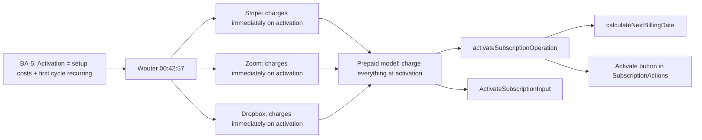

# BA-5: Activation Billing — Traceability

## Flow Diagram



---

## 1. Rule

**On activation: customer owes setup costs + first cycle recurring costs. Prepaid model.**

The activation reducer sums ALL costs across all service groups and standalone services, then writes the total to `totalDebt`. This is the initial billing event — everything before this is configuration (PENDING status).

---

## 2. Stakeholder Source

**Wouter @ 00:42:57 (Platform Sprint Planning 2026-04-09)**:

> "At that moment you owe the fixed costs and the setup cost." "You pay in advance."

This gives us:
- Setup + recurring charged together at activation
- Prepaid model — you pay before receiving the service
- This is the first billing event in the subscription lifecycle

---

## 3. Real-World Validation

### Stripe (verified)

**URL**: https://docs.stripe.com/billing/subscriptions/creating

**Screenshot**: [evidence/ba5-stripe-creating-subscriptions.png](evidence/ba5-stripe-creating-subscriptions.png)

Stripe creates the first invoice immediately when a subscription is created. Charges on activation.

### Zoom (verified)

**URL**: https://support.zoom.com/hc/en/article?id=zm_kb&sysparm_article=KB0060848

**Screenshot**: [evidence/ba5-zoom-billing.png](evidence/ba5-zoom-billing.png)

Zoom charges immediately when you upgrade or purchase a plan.

### Dropbox (verified)

**URL**: https://help.dropbox.com/plans/manage-subscription

**Screenshot**: [evidence/ba5-dropbox-subscription.png](evidence/ba5-dropbox-subscription.png)

Dropbox charges immediately on plan activation.

All charge immediately on activation. This is a universal pattern — no platform defers the initial charge.

---

## 4. Reducer Implementation

### `activateSubscriptionOperation`

**File**: [subscription.ts:207-241](document-models/subscription-instance/v1/src/reducers/subscription.ts#L207-L241)

```typescript
activateSubscriptionOperation(state, action) {
  if (state.status !== "PENDING") {
    throw new ActivateNotPendingError(
      `Cannot activate subscription with status ${state.status}`,
    );
  }
  state.status = "ACTIVE";
  state.activatedSince = action.input.activatedSince;

  // D-4, BA-5: Initialize billing state on activation
  state.currentBillingCycleStart = action.input.activatedSince;
  if (state.selectedBillingCycle) {
    state.nextBillingDate = calculateNextBillingDate(
      action.input.activatedSince,
      state.selectedBillingCycle,
    );
  }

  // Calculate initial debt: setup costs + first cycle recurring costs
  let initialDebt = 0;
  for (const group of state.serviceGroups) {
    if (group.setupCost) initialDebt += group.setupCost.amount;
    if (group.recurringCost) initialDebt += group.recurringCost.amount;
    for (const svc of group.services) {
      if (svc.setupCost) initialDebt += svc.setupCost.amount;
      if (svc.recurringCost) initialDebt += svc.recurringCost.amount;
    }
  }
  for (const svc of state.services) {
    if (svc.setupCost) initialDebt += svc.setupCost.amount;
    if (svc.recurringCost) initialDebt += svc.recurringCost.amount;
  }
  state.totalDebt = initialDebt;
  state.totalCredit = 0;
},
```

**Key behaviors**:
- PENDING-only guard
- Sets `activatedSince` timestamp
- Initializes `currentBillingCycleStart` = activation time
- Calculates `nextBillingDate` using cycle duration
- Sums ALL costs: group setup + group recurring + service setup + service recurring
- Resets `totalCredit = 0` (fresh start)
- Services within groups contribute their own costs if they have them

---

## 5. Calculation Utils

| Function | File | Purpose |
|----------|------|---------|
| `calculateNextBillingDate(fromDate, billingCycle)` | [utils.ts:41-50](document-models/subscription-instance/v1/src/utils.ts#L41-L50) | Adds cycle duration (30/91/182/365 days) to activation date |

---

## 6. Schema

```graphql
input ActivateSubscriptionInput {
    activatedSince: DateTime!
}
```

No pricing inputs — the reducer reads all costs from state (configured during PENDING phase).

---

## 7. Editor UI

### "Activate" button

**File**: [SubscriptionActions.tsx](editors/subscription-instance-editor/components/SubscriptionActions.tsx)

- Visible in **operator mode** when status is PENDING
- Opens confirmation modal showing projected costs
- Dispatches `activateSubscription({ activatedSince: new Date().toISOString() })`
- After activation: Outstanding Balance immediately shows setup + recurring total

---

## 8. Test Procedure

1. Create/open a PENDING subscription with service groups and services configured with costs
2. Switch to **Operator View**
3. Click **Activate**
4. Verify:
   - Status: ACTIVE
   - `currentBillingCycleStart`: activation timestamp
   - `nextBillingDate`: activation + cycle duration (e.g., +91 days for QUARTERLY)
   - `totalDebt`: sum of all setup + recurring costs
   - `totalCredit`: 0
   - Outstanding Balance: equals `totalDebt`
