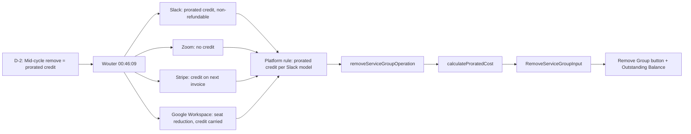

# D-2: Downgrade Policy (Mid-Cycle Remove) — Traceability

## Flow Diagram



---

## 1. Rule

**Mid-cycle service group remove = prorated credit to totalCredit. Same formula as D-1, reversed direction.**

When an operator removes a service group (add-on) mid-cycle on an ACTIVE subscription, the group's `recurringCost.amount` is prorated for the remaining days and added to `totalCredit`. The credit offsets future charges automatically (D-7).

---

## 2. Stakeholder Source

**Wouter @ 00:46:09 (Platform Sprint Planning 2026-04-09)**:

> "If I'm removing a seat, the prorata cost is deducted. It's like putting credit."

This gives us:
- The rule: credit on remove
- The mechanism: "like putting credit" — not a refund, not a deduction from debt
- Same formula as D-1, reversed direction

---

## 3. Real-World Validation

### Slack (verified)

**URL**: https://slack.com/help/articles/218915077-Slacks-Fair-Billing-Policy

**Key quote**: "We'll divide the cost per member by the number of days in the month, then multiply by the remaining number of days in the month." Credits are non-refundable and auto-applied to future charges.

**Verdict**: Prorated credit, non-refundable, auto-applied. This is the model we chose.

---

### Zoom (verified)

**URL**: https://support.zoom.com/hc/en/article?id=zm_kb&sysparm_article=KB0063375

**Verdict**: No credit on downgrade — takes effect at renewal. We did NOT follow this model.

---

### Stripe (verified)

**URL**: https://docs.stripe.com/billing/subscriptions/prorations

**Verdict**: Credit applied on next invoice, not immediately. We chose immediate credit per Wouter.

---

### Google Workspace (verified — Mar 2026 invoice)

**Source**: Apeiron's Google Workspace Business Standard invoice, March 2026.

**What happened**: 3 seats at €48.60/mo prepaid. Seats reduced from 3 → 1 on Mar 22. Final invoice: 3 seats × 22 days (€34.49) + 1 seat × 9 days (€4.70) = €39.19. The €9.41 difference carried as ending credit balance.

**Verdict**: Same proration-as-credit pattern as D-2, applied to quantity delta rather than whole group removal. Our implementation only supports whole-group removal — quantity changes within a group not yet supported.

---

## 4. Reducer Implementation

### `removeServiceGroupOperation`

**File**: [service-group.ts:85-121](document-models/subscription-instance/v1/src/reducers/service-group.ts#L85-L121)

```typescript
removeServiceGroupOperation(state, action) {
  // D-6 revised: PENDING or ACTIVE — removal creates prorated credit
  if (state.status !== "PENDING" && state.status !== "ACTIVE") {
    throw new StructuralChangeNotAllowedRemoveGroupError(
      `Cannot remove service group when status is ${state.status}`,
    );
  }
  const index = state.serviceGroups.findIndex(
    (g) => g.id === action.input.groupId,
  );
  if (index === -1) {
    throw new RemoveServiceGroupNotFoundError(
      `Service group with ID ${action.input.groupId} not found`,
    );
  }
  const group = state.serviceGroups[index];

  // D-2: Mid-cycle prorated credit on the GROUP's recurring cost
  if (
    state.status === "ACTIVE" &&
    group.recurringCost &&
    state.currentBillingCycleStart &&
    state.nextBillingDate
  ) {
    const proratedCredit = calculateProratedCost(
      group.recurringCost.amount,
      state.currentBillingCycleStart,
      state.nextBillingDate,
      new Date().toISOString(),
    );
    if (proratedCredit > 0) {
      state.totalCredit = (state.totalCredit ?? 0) + proratedCredit;
    }
  }

  state.serviceGroups.splice(index, 1);
},
```

**Key behaviors**:
- Status guard: PENDING or ACTIVE (D-6 revised)
- Reads `recurringCost.amount` from the group state — no pricing input needed
- Proration only when ACTIVE + group has `recurringCost`
- Credit added to `totalCredit`, not subtracted from `totalDebt`
- PENDING = setup phase, no proration (just removes the group)
- Group is spliced from array after credit calculation

### Why services don't have proration

Same as D-1: individual services (`removeServiceFromGroup`) don't carry pricing. The group is the billable unit. Comment in [service-group.ts:192](document-models/subscription-instance/v1/src/reducers/service-group.ts#L192): `// No proration here — services don't carry pricing, groups do (D-2 revised)`.

---

## 5. Calculation Utils

Same function as D-1 — `calculateProratedCost()` in [utils.ts:58-68](document-models/subscription-instance/v1/src/utils.ts#L58-L68).

The only difference is the output direction:
- D-1: result → `totalDebt`
- D-2: result → `totalCredit`

---

## 6. Schema (Input Types)

```graphql
input RemoveServiceGroupInput {
    groupId: OID!
}
```

Minimal input — no pricing fields needed. The reducer reads `recurringCost.amount` from the group's existing state to calculate the prorated credit.

---

## 7. Editor UI

### "Remove Group" button

**File**: [ServicesPanel.tsx](editors/subscription-instance-editor/components/ServicesPanel.tsx)

- Visible on optional/add-on groups in **operator mode** when status is PENDING or ACTIVE
- Dispatches `removeServiceGroup({ groupId })`
- When ACTIVE: reducer calculates prorated credit → `totalCredit` increases → Outstanding Balance decreases
- When PENDING: no proration, just removes the group

### Outstanding Balance display

**File**: [BillingPanel.tsx](editors/subscription-instance-editor/components/BillingPanel.tsx)

- Shows `totalDebt - totalCredit` as "Outstanding Balance"
- Updates immediately when credit is added
- When negative (D-7): shows "Credit Balance" in green

---

## 8. Test Procedure

### Step 1: Set up an active subscription with an add-on group

1. Activate a subscription (D-1 test Step 1)
2. Add a service group mid-cycle (D-1 test Step 3)
3. Note the Outstanding Balance after the prorated debit

### Step 2: Remove the group mid-cycle

1. Click **Remove Group** on the add-on group
2. Verify:
   - Group disappears from the services panel
   - Outstanding Balance decreases by the prorated credit amount
   - The credit amount should be proportional to remaining days in cycle

### Step 3: Verify the math

Check the operation history. The `REMOVE_SERVICE_GROUP` operation should show, and `totalCredit` should have increased by the prorated amount. The formula is identical to D-1: `(remainingDays / totalDays) * recurringCost.amount`.
