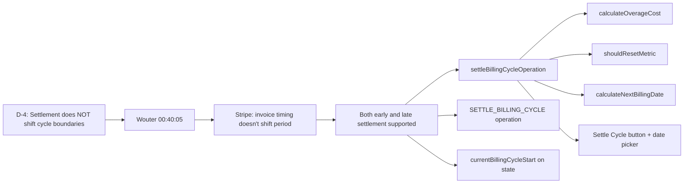

# D-4: Settlement Timing (Cycle Boundaries Stay Fixed) — Traceability

## Flow Diagram



---

## 1. Rule

**Settlement triggers billing calculation but does NOT shift cycle boundaries. Both early and late settlement supported.**

- **Late settlement**: Operator missed the date. Overage calculated up to `nextBillingDate`, not the actual settlement date.
- **Early settlement**: Customer cancels mid-cycle, tier switch, dispute resolution. Overage calculated up to `settlementDate`.
- In both cases, `nextBillingDate` advances from its original value, not from when settlement ran.

---

## 2. Stakeholder Source

**Wouter @ 00:40:05 (Platform Sprint Planning 2026-04-09)**:

> "There will be situations where you want to just close the billing cycle prematurely... or we've just been lagging and it's like 6 weeks and we want to bill now."

This gives us:
- Early settlement is a deliberate operator action (cancellation, dispute)
- Late settlement is an operational reality (lagging)
- Both must be supported without shifting future cycle boundaries

---

## 3. Real-World Validation

### Stripe (verified)

**URL**: https://docs.stripe.com/billing/subscriptions/prorations

Stripe's invoice timing doesn't shift the subscription period. Prorations happen on plan changes, not on invoice timing. Invoice date is independent of cycle boundaries.

**Verdict**: Matches our rule — settlement/invoicing is decoupled from cycle boundary management.

---

## 4. Reducer Implementation

### `settleBillingCycleOperation`

**File**: [subscription.ts:355-427](document-models/subscription-instance/v1/src/reducers/subscription.ts#L355-L427)

```typescript
settleBillingCycleOperation(state, action) {
  if (state.status !== "ACTIVE") {
    throw new NoBillingCycleActiveError(
      `Cannot settle billing cycle when status is ${state.status}`,
    );
  }
  if (
    state.currentBillingCycleStart &&
    action.input.settlementDate < state.currentBillingCycleStart
  ) {
    throw new SettlementDateBeforeCycleStartError(
      "Settlement date is before the current billing cycle start",
    );
  }

  // D-4: Overage window — endDate = min(settlementDate, nextBillingDate)
  const _endDate =
    state.nextBillingDate &&
    action.input.settlementDate > state.nextBillingDate
      ? state.nextBillingDate
      : action.input.settlementDate;

  // Calculate overage and reset metrics
  const billingCycle = state.selectedBillingCycle || "MONTHLY";
  function processMetrics(metrics) {
    for (const metric of metrics) {
      const cost = calculateOverageCost(metric);
      if (cost > 0) {
        state.totalDebt = (state.totalDebt ?? 0) + cost;
      }
      if (shouldResetMetric(metric, billingCycle)) {
        metric.currentUsage = 0;
      }
    }
  }

  for (const svc of state.services) {
    processMetrics(svc.metrics);
  }
  for (const group of state.serviceGroups) {
    for (const svc of group.services) {
      processMetrics(svc.metrics);
    }
  }

  if (state.autoRenew) {
    // Add next cycle recurring costs to totalDebt
    for (const group of state.serviceGroups) {
      if (group.recurringCost) {
        state.totalDebt = (state.totalDebt ?? 0) + group.recurringCost.amount;
      }
    }
    for (const svc of state.services) {
      if (svc.recurringCost) {
        state.totalDebt = (state.totalDebt ?? 0) + svc.recurringCost.amount;
      }
    }
    // Advance cycle boundaries (D-4: fixed boundaries)
    state.currentBillingCycleStart = state.nextBillingDate;
    if (state.nextBillingDate) {
      state.nextBillingDate = calculateNextBillingDate(
        state.nextBillingDate,
        billingCycle,
      );
    }
  } else {
    state.status = "EXPIRING";
    state.expiringSince = action.input.settlementDate;
  }
},
```

**Key behaviors**:
- ACTIVE-only guard
- Settlement date must be after cycle start
- Overage window: `min(settlementDate, nextBillingDate)` — late settlement doesn't capture extra usage
- All metrics processed: overage calculated, then reset if `shouldResetMetric()` returns true
- Auto-renew path: adds recurring costs for next cycle, advances boundaries FROM `nextBillingDate` (not from settlement date)
- Manual renewal path: status → EXPIRING (D-9 handles the renewal)

**Errors**:
- `NoBillingCycleActiveError` — status not ACTIVE
- `SettlementDateBeforeCycleStartError` — date validation

---

## 5. Calculation Utils

| Function | File | Purpose |
|----------|------|---------|
| `calculateOverageCost(metric)` | [utils.ts:75-88](document-models/subscription-instance/v1/src/utils.ts#L75-L88) | `max(0, currentUsage - freeLimit) * unitCost.amount`, capped at paidLimit |
| `shouldResetMetric(metric, billingCycle)` | [utils.ts:142-151](document-models/subscription-instance/v1/src/utils.ts#L142-L151) | Hierarchy check: MONTHLY <= QUARTERLY means reset |
| `calculateNextBillingDate(fromDate, billingCycle)` | [utils.ts:41-50](document-models/subscription-instance/v1/src/utils.ts#L41-L50) | Adds cycle duration to date |

---

## 6. Schema

### Operation Added

```graphql
input SettleBillingCycleInput {
    settlementDate: DateTime!
}
```

### State Field Added

```graphql
type SubscriptionInstanceState {
    currentBillingCycleStart: DateTime    # Explicit cycle start for proration window
}
```

---

## 7. Editor UI

### "Settle Cycle" button

**File**: [SubscriptionActions.tsx](editors/subscription-instance-editor/components/SubscriptionActions.tsx)

- Visible in **operator mode** when status is ACTIVE
- Shows current cycle boundaries
- Date picker allows custom settlement date (for simulating future/past settlement)
- Dispatches `settleBillingCycle({ settlementDate })`

---

## 8. Test Procedure

### On-time settlement (autoRenew=true)

1. Activate → add usage above free limits → settle with date = `nextBillingDate`
2. Verify: overage added to `totalDebt`, metrics reset, cycle advanced, status stays ACTIVE

### Late settlement

1. Activate → add usage → settle with date after `nextBillingDate`
2. Verify: overage still calculated correctly (window capped at `nextBillingDate`), cycle advanced

### Early settlement

1. Activate → add usage → settle with date before `nextBillingDate`
2. Verify: overage calculated up to `settlementDate`, cycle advanced

### Manual renewal path (autoRenew=false)

1. Turn off auto-renew → settle
2. Verify: status → EXPIRING, no recurring costs added, cycle boundaries unchanged
