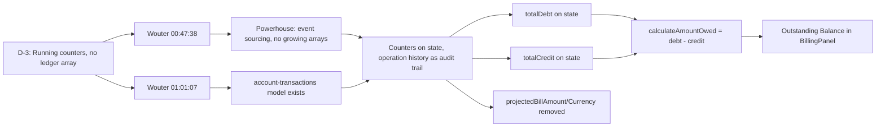

# D-3: Ledger Structure (Counters, Not Arrays) — Traceability

## Flow Diagram



---

## 1. Rule

**Running counters only (`totalDebt`, `totalCredit`) on SubscriptionInstanceState. No ledger entries array. Audit trail lives in the Reactor's operation history.**

Every reducer that touches money updates the counters directly. The billing breakdown is derived from operation history via utils, not from state.

---

## 2. Stakeholder Source

**Wouter @ 00:47:38 (Platform Sprint Planning 2026-04-09)**:

> "We need to keep a record somewhere of these changes."

**Wouter @ 01:01:07**:

> "Derived values" and "pure query function utility"

This tells us:
- Records are needed (audit trail)
- Values should be derived, not stored redundantly
- Query functions compute what's needed from existing state

---

## 3. Real-World Validation

### Powerhouse pattern

No existing Powerhouse document model uses unbounded growing arrays for transaction history. State is a snapshot, not a log. The Reactor's operation log already records every action immutably — this IS the audit trail.

### account-transactions model

The `powerhouse/account-transactions` model exists specifically for financial transaction records. If detailed ledger entries are needed, they belong in a separate document, not embedded in the subscription state.

### Design rationale

Initially designed an explicit `ledgerEntries` array — rejected because:
1. No existing doc model uses growing arrays for transaction history
2. State is a snapshot, not a log — existing payment fields are single-value overwrites
3. The Reactor's operation log already records every action immutably
4. `powerhouse/account-transactions` exists for financial records

---

## 4. Schema Changes

### Fields Added to SubscriptionInstanceState

```graphql
type SubscriptionInstanceState {
    # ... existing fields ...
    totalDebt: Amount_Money       # Running sum of all charges
    totalCredit: Amount_Money     # Running sum of all payments/credits
}
```

### Fields Removed

| Field | Reason |
|-------|--------|
| `projectedBillAmount` | Now derived via `calculateAmountOwed()` |
| `projectedBillCurrency` | Now uses `globalCurrency` |

### Operations Removed

| Operation | Reason |
|-----------|--------|
| `UPDATE_BILLING_PROJECTION` | State fields removed; projection is now derived |

---

## 5. Reducer Touchpoints

Every reducer that touches money updates counters directly:

| Reducer | File | Counter | Direction |
|---------|------|---------|-----------|
| `activateSubscriptionOperation` | [subscription.ts:207-241](document-models/subscription-instance/v1/src/reducers/subscription.ts#L207-L241) | `totalDebt` | Setup + recurring costs summed |
| `addServiceGroupOperation` | [service-group.ts:17-84](document-models/subscription-instance/v1/src/reducers/service-group.ts#L17-L84) | `totalDebt` | Prorated recurring + setup |
| `removeServiceGroupOperation` | [service-group.ts:85-121](document-models/subscription-instance/v1/src/reducers/service-group.ts#L85-L121) | `totalCredit` | Prorated credit |
| `settleBillingCycleOperation` | [subscription.ts:355-427](document-models/subscription-instance/v1/src/reducers/subscription.ts#L355-L427) | `totalDebt` | Overage + next cycle recurring |
| `renewExpiringSubscriptionOperation` | [subscription.ts:279-311](document-models/subscription-instance/v1/src/reducers/subscription.ts#L279-L311) | `totalDebt` | Next cycle recurring costs |
| `resetMetricCycleOperation` | [metrics.ts:190-226](document-models/subscription-instance/v1/src/reducers/metrics.ts#L190-L226) | `totalDebt` | Metric overage |
| `reportSetupPaymentOperation` | [service.ts:149-177](document-models/subscription-instance/v1/src/reducers/service.ts#L149-L177) | `totalCredit` | Payment amount (read from state `setupCost.amount`, not input) |
| `reportRecurringPaymentOperation` | [service.ts:178-206](document-models/subscription-instance/v1/src/reducers/service.ts#L178-L206) | `totalCredit` | Payment amount (read from state `recurringCost.amount`, not input) |
| `reportOveragePaymentOperation` | [service.ts:249-262](document-models/subscription-instance/v1/src/reducers/service.ts#L249-L262) | `totalCredit` | Overage/balance payment amount |

---

## 6. Calculation Utils

**File**: [utils.ts:117-122](document-models/subscription-instance/v1/src/utils.ts#L117-L122)

```typescript
export function calculateAmountOwed(state: {
  totalDebt?: number | null;
  totalCredit?: number | null;
}): number {
  return (state.totalDebt ?? 0) - (state.totalCredit ?? 0);
}
```

- Returns raw difference — can be negative (D-7)
- No floor — negative means customer has credit surplus
- Used by editor to display Outstanding Balance / Credit Balance / Paid up

---

## 7. Editor UI

### BillingPanel

**File**: [BillingPanel.tsx](editors/subscription-instance-editor/components/BillingPanel.tsx)

- **Outstanding Balance**: `totalDebt - totalCredit` as headline
- Raw counters hidden from UI — only the derived value is shown
- Color coding: red when positive (owes money), green when negative (credit surplus, D-7), neutral when zero ("Paid up")

### billing-utils

**File**: [billing-utils.ts](editors/subscription-instance-editor/components/billing-utils.ts)

- `computeBillingBreakdown()` computes the full cost projection
- `computeMetricOverage()` delegates to doc model `calculateOverageCost()` for per-metric overage
