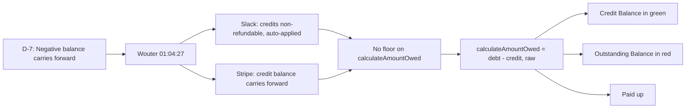

# D-7: Negative Balance (Carry Forward) — Traceability

## Flow Diagram



---

## 1. Rule

**When `totalDebt - totalCredit` is negative (customer overpaid), surplus carries forward. No floor, no refund in doc model.**

Next cycle's recurring charge adds to `totalDebt`, and the balance trends back to zero naturally. Refunds are a payment layer concern (Stripe), not a doc model concern.

---

## 2. Stakeholder Source

**Wouter @ 01:04:27 (Platform Sprint Planning 2026-04-09)**:

> "If the payment comes in you update the credit and that's how you get to a balance of zero."

This tells us:
- Payments update credit counter
- Balance = debt - credit
- Natural convergence to zero — no special handling needed

---

## 3. Real-World Validation

### Slack (verified)

Credits are non-refundable and auto-applied to future charges. Surplus carries forward.

### Stripe (verified)

Credit balance carries forward. Customer credit is applied automatically to the next invoice.

---

## 4. Calculation Utils

**File**: [utils.ts:117-122](document-models/subscription-instance/v1/src/utils.ts#L117-L122)

```typescript
export function calculateAmountOwed(state: {
  totalDebt?: number | null;
  totalCredit?: number | null;
}): number {
  return (state.totalDebt ?? 0) - (state.totalCredit ?? 0);
}
```

- Returns raw difference — **no `Math.max(0, ...)` floor**
- Negative result = customer has credit surplus
- Positive result = customer owes money
- Zero = paid up

---

## 5. Reducer Implications

No reducer changes needed for D-7 — the math just works. Counters are cumulative:
- Overpayment: `totalCredit` exceeds `totalDebt` → negative balance
- Next cycle: settlement adds recurring costs to `totalDebt` → balance trends toward zero
- Capping at zero would hide the surplus from the operator

---

## 6. Editor UI

### BillingPanel display logic

**File**: [BillingPanel.tsx](editors/subscription-instance-editor/components/BillingPanel.tsx)

| Condition | Display | Styling |
|-----------|---------|---------|
| `amountOwed > 0` | "Outstanding Balance: $X" | Red |
| `amountOwed < 0` | "Credit Balance: $X" | Green |
| `amountOwed === 0` | "Paid up" | Neutral |

### SubscriptionHeader

**File**: [SubscriptionHeader.tsx](editors/subscription-instance-editor/components/SubscriptionHeader.tsx)

Status badge shows Outstanding/Credit/Paid up as a quick indicator.

---

## 7. Test Procedure

1. Activate → note `totalDebt`
2. Report a payment exceeding `totalDebt` (overpay)
3. Verify: "Credit Balance" displayed in green
4. Add a new charge (e.g., add service group mid-cycle)
5. Verify: credit offsets the new charge, balance moves toward zero
