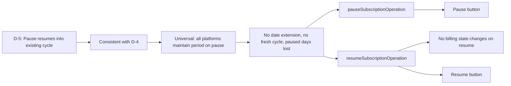

# D-5: Pause/Resume (Continue Existing Cycle) — Traceability

## Flow Diagram



---

## 1. Rule

**Paused subscription resumes into existing cycle. No date extension, no fresh cycle. Paused days are lost.**

Pausing is an operator action (non-payment, maintenance), not a customer benefit. The cycle clock keeps ticking. When resumed, the subscription continues as if it was never paused — same `nextBillingDate`, same `currentBillingCycleStart`, same counters.

---

## 2. Stakeholder Source

No direct Wouter quote — this follows logically from D-4 (cycle boundaries stay fixed). If settlement doesn't shift boundaries, pause/resume shouldn't either.

**Rationale**:
- Extending the cycle would shift all future dates (violates D-4)
- Starting a fresh cycle would trigger early settlement + new charges (over-engineered)
- Pausing is an operator action, not a customer benefit

---

## 3. Real-World Validation

Universal — all platforms maintain subscription period on pause. No platform extends the cycle for paused time.

---

## 4. Reducer Implementation

### `pauseSubscriptionOperation`

**File**: [subscription.ts:242-250](document-models/subscription-instance/v1/src/reducers/subscription.ts#L242-L250)

```typescript
pauseSubscriptionOperation(state, action) {
  if (state.status !== "ACTIVE") {
    throw new PauseNotActiveError(
      `Cannot pause subscription with status ${state.status}`,
    );
  }
  state.status = "PAUSED";
  state.pausedSince = action.input.pausedSince;
},
```

### `resumeSubscriptionOperation`

**File**: [subscription.ts:270-278](document-models/subscription-instance/v1/src/reducers/subscription.ts#L270-L278)

```typescript
resumeSubscriptionOperation(state, _action) {
  if (state.status !== "PAUSED") {
    throw new ResumeNotPausedError(
      `Cannot resume subscription with status ${state.status}`,
    );
  }
  state.status = "ACTIVE";
  state.pausedSince = null;
},
```

**Key behaviors**:
- Pause: ACTIVE → PAUSED, records `pausedSince` timestamp
- Resume: PAUSED → ACTIVE, clears `pausedSince`
- **No billing state changes**: `totalDebt`, `totalCredit`, `currentBillingCycleStart`, `nextBillingDate` all untouched
- D-6: PAUSED status blocks metric operations (usage frozen)

---

## 5. Schema

No schema changes needed — existing inputs are sufficient:

```graphql
input PauseSubscriptionInput {
    pausedSince: DateTime!
}

input ResumeSubscriptionInput {
    timestamp: DateTime!
}
```

---

## 6. Editor UI

### "Pause" button

**File**: [SubscriptionActions.tsx](editors/subscription-instance-editor/components/SubscriptionActions.tsx)

- Visible in **operator mode** when status is ACTIVE
- Opens confirmation modal with reason selection (non-payment, maintenance)
- Dispatches `pauseSubscription({ pausedSince })`

### "Resume" button

**File**: [SubscriptionActions.tsx](editors/subscription-instance-editor/components/SubscriptionActions.tsx)

- Visible in **operator mode** when status is PAUSED
- Dispatches `resumeSubscription({ timestamp })`
- Metric +/- controls re-enable after resume

---

## 7. Test Procedure

1. Activate → note `nextBillingDate` and `currentBillingCycleStart`
2. Pause → verify status is PAUSED
3. Verify metric +/- is disabled
4. Resume → verify:
   - Status: ACTIVE
   - `nextBillingDate`: unchanged
   - `currentBillingCycleStart`: unchanged
   - `totalDebt`: unchanged
   - `totalCredit`: unchanged
