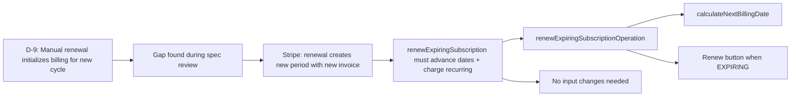

# D-9: Manual Renewal Billing — Traceability

## Flow Diagram



---

## 1. Rule

**When `autoRenew=false`, settlement → EXPIRING. Manual renewal via `renewExpiringSubscription` initializes billing for the new cycle: advance `currentBillingCycleStart` to `nextBillingDate`, calculate new `nextBillingDate`, add recurring costs to `totalDebt`.**

Cycle starts from `nextBillingDate` (not from renewal timestamp) per D-4 fixed boundary rule.

---

## 2. Stakeholder Source

**Gap found during spec review** — not from sprint planning. The `renewExpiringSubscription` reducer existed but didn't touch billing state, leaving stale cycle boundaries. Proration after manual renewal would calculate against expired cycle boundaries.

---

## 3. Real-World Validation

### Stripe (verified)

Renewal creates a new billing period with new invoice items. The new period starts from where the old one ended, not from when the renewal was triggered.

---

## 4. Reducer Implementation

### `renewExpiringSubscriptionOperation`

**File**: [subscription.ts:279-311](document-models/subscription-instance/v1/src/reducers/subscription.ts#L279-L311)

```typescript
renewExpiringSubscriptionOperation(state, action) {
  if (state.status !== "EXPIRING") {
    throw new RenewNotExpiringError(
      `Cannot renew subscription with status ${state.status}`,
    );
  }
  state.status = "ACTIVE";
  state.expiringSince = null;

  // D-9: Initialize billing state for new cycle
  // Cycle starts from nextBillingDate (fixed boundaries per D-4)
  state.currentBillingCycleStart = state.nextBillingDate;
  if (state.nextBillingDate && state.selectedBillingCycle) {
    state.nextBillingDate = calculateNextBillingDate(
      state.nextBillingDate,
      state.selectedBillingCycle,
    );
  }

  // Add recurring costs for the new cycle to totalDebt
  for (const group of state.serviceGroups) {
    if (group.recurringCost) {
      state.totalDebt = (state.totalDebt ?? 0) + group.recurringCost.amount;
    }
  }
  for (const svc of state.services) {
    if (svc.recurringCost) {
      state.totalDebt = (state.totalDebt ?? 0) + svc.recurringCost.amount;
    }
  }

  state.renewalDate = action.input.newRenewalDate || null;
},
```

**Key behaviors**:
- EXPIRING-only guard
- Clears `expiringSince`
- Advances `currentBillingCycleStart` to old `nextBillingDate` (D-4: fixed boundaries)
- Calculates new `nextBillingDate` from old `nextBillingDate`
- Sums all recurring costs → `totalDebt` (same logic as auto-renew path in settlement)
- Does NOT re-charge setup costs (one-time only)

---

## 5. Calculation Utils

| Function | File | Purpose |
|----------|------|---------|
| `calculateNextBillingDate(fromDate, billingCycle)` | [utils.ts:41-50](document-models/subscription-instance/v1/src/utils.ts#L41-L50) | Adds cycle duration to date |

---

## 6. Schema

No input schema changes — existing `RenewExpiringSubscriptionInput` is sufficient:

```graphql
input RenewExpiringSubscriptionInput {
    newRenewalDate: DateTime
}
```

---

## 7. Editor UI

### "Renew" button

**File**: [SubscriptionActions.tsx](editors/subscription-instance-editor/components/SubscriptionActions.tsx)

- Visible in **operator mode** when status is EXPIRING
- Dispatches `renewExpiringSubscription({ newRenewalDate })`
- After renewal: status → ACTIVE, new cycle boundaries set, recurring costs charged

---

## 8. Test Procedure

1. Turn off auto-renew
2. Settle → verify status is EXPIRING
3. Click "Renew"
4. Verify:
   - Status: ACTIVE
   - `currentBillingCycleStart`: old `nextBillingDate`
   - `nextBillingDate`: advanced by one cycle from old `nextBillingDate`
   - `totalDebt`: increased by sum of all recurring costs
