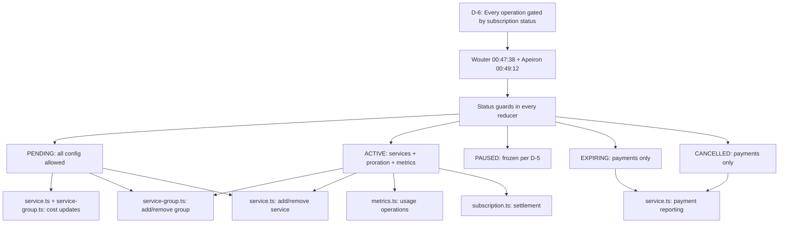

# D-6: Operation Status Matrix — Traceability

## Flow Diagram



---

## 1. Rule

**Every operation is gated by subscription status. Service groups (add-ons with pricing) can be added/removed on ACTIVE with proration. Individual services (no pricing) can be added/removed without billing impact. Cost updates PENDING only.**

---

## 2. Stakeholder Source

**Wouter @ 00:47:38 (Platform Sprint Planning 2026-04-09)**:

> "From the moment you cancel there can't be any additional usage."

**Apeiron @ 00:49:12**: Confirmed no mid-cycle group add at the time. Later revised: groups carry pricing, so mid-cycle group changes ARE the proration mechanism (D-1/D-2).

---

## 3. Real-World Validation

### Zoom (verified)

**URL**: https://support.zoom.com/hc/en/article?id=zm_kb&sysparm_article=KB0063375

**Screenshot**: [evidence/d6-zoom-upgrade-downgrade.png](evidence/d6-zoom-upgrade-downgrade.png)

Zoom: "you will lose all associated plan features" on downgrade/cancellation.

Universal — all platforms freeze functionality on cancellation.

---

## 4. Status Matrix

| Operation | PENDING | ACTIVE | PAUSED | EXPIRING | CANCELLED |
|-----------|---------|--------|--------|----------|-----------|
| `addServiceGroup` | yes | yes (D-1 proration) | no | no | no |
| `removeServiceGroup` | yes | yes (D-2 credit) | no | no | no |
| `addService`, `addServiceToGroup` | yes | yes (no proration) | no | no | no |
| `removeService`, `removeServiceFromGroup` | yes | yes (no proration) | no | no | no |
| `updateMetricUsage` | no | yes | no | no | no |
| `incrementMetricUsage` | no | yes | no | no | no |
| `decrementMetricUsage` | no | yes | no | no | no |
| `resetMetricCycle` | no | yes | no | no | no |
| `settleBillingCycle` | no | yes | no | no | no |
| `updateServiceSetupCost` | yes | no | no | no | no |
| `updateServiceRecurringCost` | yes | no | no | no | no |
| `updateServiceGroupCost` | yes | no | no | no | no |
| `reportSetupPayment` | yes | yes | yes | yes | yes |
| `reportRecurringPayment` | yes | yes | yes | yes | yes |

---

## 5. Reducer Implementation — Status Guards

### Service group guards

**File**: [service-group.ts](document-models/subscription-instance/v1/src/reducers/service-group.ts)

```typescript
// addServiceGroupOperation (line 19)
if (state.status !== "PENDING" && state.status !== "ACTIVE") {
  throw new StructuralChangeNotAllowedAddGroupError(...);
}

// removeServiceGroupOperation (line 87)
if (state.status !== "PENDING" && state.status !== "ACTIVE") {
  throw new StructuralChangeNotAllowedRemoveGroupError(...);
}

// addServiceToGroupOperation (line 124)
if (state.status !== "PENDING" && state.status !== "ACTIVE") {
  throw new SubscriptionNotActiveAddToGroupError(...);
}

// removeServiceFromGroupOperation (line 171)
if (state.status !== "PENDING" && state.status !== "ACTIVE") {
  throw new SubscriptionNotActiveRemoveFromGroupError(...);
}

// updateServiceGroupCostOperation (line 197)
if (state.status !== "PENDING") return;
```

### Metric guards

**File**: [metrics.ts](document-models/subscription-instance/v1/src/reducers/metrics.ts)

```typescript
// updateMetricUsageOperation (line 89)
if (state.status !== "ACTIVE") {
  throw new SubscriptionNotActiveUpdateUsageError(...);
}

// incrementMetricUsageOperation (line 138)
if (state.status !== "ACTIVE") {
  throw new SubscriptionNotActiveIncrementUsageError(...);
}

// decrementMetricUsageOperation (line 167)
if (state.status !== "ACTIVE") {
  throw new SubscriptionNotActiveDecrementUsageError(...);
}

// resetMetricCycleOperation (line 192)
if (state.status !== "ACTIVE") {
  throw new SubscriptionNotActiveResetMetricCycleError(...);
}
```

### Service guards

**File**: [service.ts](document-models/subscription-instance/v1/src/reducers/service.ts)

```typescript
// addServiceOperation (line 20)
if (state.status !== "PENDING" && state.status !== "ACTIVE") {
  throw new SubscriptionNotActiveAddServiceError(...);
}

// removeServiceOperation (line 70)
if (state.status !== "PENDING" && state.status !== "ACTIVE") {
  throw new SubscriptionNotActiveRemoveServiceError(...);
}

// updateServiceSetupCostOperation (line 89)
if (state.status !== "PENDING") return;

// updateServiceRecurringCostOperation (line 114)
if (state.status !== "PENDING") return;
```

### Payment — no status guard

**File**: [service.ts](document-models/subscription-instance/v1/src/reducers/service.ts)

`reportSetupPaymentOperation` and `reportRecurringPaymentOperation` have no status check — payments are always accepted regardless of subscription status.

---

## 6. Error Types

| Error | Used by |
|-------|---------|
| `StructuralChangeNotAllowedAddGroupError` | `addServiceGroup` |
| `StructuralChangeNotAllowedRemoveGroupError` | `removeServiceGroup` |
| `SubscriptionNotActiveAddServiceError` | `addService` |
| `SubscriptionNotActiveRemoveServiceError` | `removeService` |
| `SubscriptionNotActiveAddToGroupError` | `addServiceToGroup` |
| `SubscriptionNotActiveRemoveFromGroupError` | `removeServiceFromGroup` |
| `SubscriptionNotActiveUpdateUsageError` | `updateMetricUsage` |
| `SubscriptionNotActiveIncrementUsageError` | `incrementMetricUsage` |
| `SubscriptionNotActiveDecrementUsageError` | `decrementMetricUsage` |
| `SubscriptionNotActiveResetMetricCycleError` | `resetMetricCycle` |

---

## 7. Editor UI

**File**: [SubscriptionActions.tsx](editors/subscription-instance-editor/components/SubscriptionActions.tsx)

Controls disabled/hidden based on status:
- Metric +/- disabled when not ACTIVE
- Add/Remove group disabled when PAUSED/EXPIRING/CANCELLED
- Cost edit fields hidden when not PENDING
- Payment buttons always visible

---

## 8. Gaps

| Feature | Status | Notes |
|---------|--------|-------|
| `updateServiceInfo` status guard | **MISSING** | Lower priority — info updates, not billing-impacting |
| `addServiceFacetSelection` status guard | **MISSING** | Lower priority |
| `removeServiceFacetSelection` status guard | **MISSING** | Lower priority |
