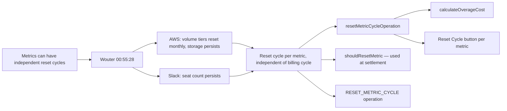

# Independent Metric Reset Cycles — Traceability

## Flow Diagram



---

## 1. Rule

**Metrics can have independent reset cycles (e.g., MONTHLY on a QUARTERLY subscription). At reset: overage is calculated and charged, then usage resets to 0.**

Two triggers for metric reset:
1. **Manual reset** via `RESET_METRIC_CYCLE` operation (operator action)
2. **Automatic at settlement** via `shouldResetMetric()` check (D-4 settlement reducer)

---

## 2. Stakeholder Source

**Wouter @ 00:55:28 (Platform Sprint Planning 2026-04-09)**:

> "Reset cycles can be set at the individual metric level, independent of the billing cycle."

Service offering defines `resetCycle` per metric, inherited by subscription via `mapOfferingToSubscription()`.

---

## 3. Real-World Validation

### AWS

AWS Lambda pricing is "per 1M requests" and "per GB-second" — these reset monthly. AWS S3 storage pricing is cumulative (you pay for what's stored), but data transfer tiers reset monthly. The Free Tier explicitly states monthly limits (e.g., "1M free requests per month"). Different metrics on the same account have different reset behaviors — Lambda request counts reset each month while S3 storage volume is a running total.

### Slack

Seat count persists — it's not usage that resets, it's a per-seat price. This is the counter-example: a metric that does NOT reset, validating that reset behavior must be configurable per metric.

---

## 4. Reducer Implementation

### `resetMetricCycleOperation`

**File**: [metrics.ts:190-226](document-models/subscription-instance/v1/src/reducers/metrics.ts#L190-L226)

```typescript
resetMetricCycleOperation(state, action) {
  // ACTIVE only — metric resets happen during an active billing cycle
  if (state.status !== "ACTIVE") {
    throw new SubscriptionNotActiveResetMetricCycleError(
      `Cannot reset metric cycle when status is ${state.status}`,
    );
  }
  const svc = findServiceById(
    action.input.serviceId,
    state.services,
    state.serviceGroups,
  );
  if (!svc) {
    throw new ResetMetricCycleServiceNotFoundError(
      `Service with ID ${action.input.serviceId} not found`,
    );
  }
  const metric = svc.metrics.find((m) => m.id === action.input.metricId);
  if (!metric) {
    throw new ResetMetricCycleMetricNotFoundError(
      `Metric with ID ${action.input.metricId} not found`,
    );
  }
  // Calculate and charge overage before resetting
  if (metric.unitCost) {
    const freeLimit = metric.freeLimit ?? 0;
    let overage = Math.max(0, metric.currentUsage - freeLimit);
    if (metric.paidLimit) {
      overage = Math.min(overage, metric.paidLimit - freeLimit);
    }
    const cost = overage * metric.unitCost.amount;
    if (cost > 0) {
      state.totalDebt = (state.totalDebt ?? 0) + cost;
    }
  }
  metric.currentUsage = 0;
},
```

**Key behaviors**:
- ACTIVE-only guard (D-6)
- Finds service across flat + grouped via `findServiceById()`
- Calculates overage inline (same formula as `calculateOverageCost()`)
- Charges overage to `totalDebt` BEFORE resetting
- Resets `currentUsage = 0`

### Settlement integration

At settlement time, `settleBillingCycleOperation` in [subscription.ts:381-400](document-models/subscription-instance/v1/src/reducers/subscription.ts#L381-L400) loops through all metrics and calls `shouldResetMetric()` to determine which metrics to reset:

```typescript
function processMetrics(metrics) {
  for (const metric of metrics) {
    const cost = calculateOverageCost(metric);
    if (cost > 0) {
      state.totalDebt = (state.totalDebt ?? 0) + cost;
    }
    if (shouldResetMetric(metric, billingCycle)) {
      metric.currentUsage = 0;
    }
  }
}
```

---

## 5. Calculation Utils

### `calculateOverageCost`

**File**: [utils.ts:75-88](document-models/subscription-instance/v1/src/utils.ts#L75-L88)

```typescript
export function calculateOverageCost(metric: {
  currentUsage: number;
  freeLimit?: number | null;
  paidLimit?: number | null;
  unitCost?: { amount: number } | null;
}): number {
  if (!metric.unitCost) return 0;
  const freeLimit = metric.freeLimit ?? 0;
  let overage = Math.max(0, metric.currentUsage - freeLimit);
  if (metric.paidLimit) {
    overage = Math.min(overage, metric.paidLimit - freeLimit);
  }
  return overage * metric.unitCost.amount;
}
```

Formula: `max(0, currentUsage - freeLimit) * unitCost.amount`, capped at `(paidLimit - freeLimit)`.

### `shouldResetMetric`

**File**: [utils.ts:142-151](document-models/subscription-instance/v1/src/utils.ts#L142-L151)

```typescript
export function shouldResetMetric(
  metric: { usageResetPeriod?: string | null },
  billingCycle: string,
): boolean {
  if (!metric.usageResetPeriod) return false;
  const metricIndex = RESET_HIERARCHY.indexOf(metric.usageResetPeriod);
  const cycleIndex = RESET_HIERARCHY.indexOf(billingCycle);
  if (metricIndex === -1 || cycleIndex === -1) return false;
  return metricIndex <= cycleIndex;
}
```

Hierarchy: `HOURLY < DAILY < WEEKLY < MONTHLY < QUARTERLY < SEMI_ANNUAL < ANNUAL`. A MONTHLY reset period triggers on QUARTERLY settlement because MONTHLY <= QUARTERLY.

---

## 6. Schema

```graphql
input ResetMetricCycleInput {
    serviceId: OID!
    metricId: OID!
    resetDate: DateTime!
}
```

---

## 7. Editor UI

### Reset Cycle button

**File**: [MetricActions.tsx](editors/subscription-instance-editor/components/MetricActions.tsx)

- Rotate icon button on metrics with `usageResetPeriod`
- Visible when `currentUsage > 0`
- Dispatches `resetMetricCycle({ serviceId, metricId, resetDate })`

---

## 8. Test Procedure

1. Activate → increment metric usage above free limit
2. Click reset cycle button on that metric
3. Verify:
   - `currentUsage` reset to 0
   - `totalDebt` increased by overage amount
   - Overage = `max(0, usage - freeLimit) * unitCost.amount`
