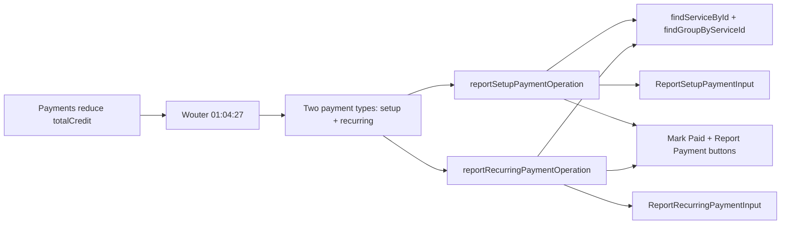

# Payment Reporting — Traceability

## Flow Diagram



---

## 1. Rule

**Payments increase `totalCredit`. Can be reported for setup costs (one-time) or recurring costs (per cycle). Accepts service ID or group ID.**

No status guard — payments are always accepted regardless of subscription status (D-6). This makes sense: a cancelled subscriber can still pay an outstanding balance.

---

## 2. Stakeholder Source

**Wouter @ 01:04:27 (Platform Sprint Planning 2026-04-09)**:

> "If the payment comes in you update the credit."

---

## 3. Reducer Implementation

### `reportSetupPaymentOperation`

**File**: [service.ts:149-177](document-models/subscription-instance/v1/src/reducers/service.ts#L149-L177)

```typescript
reportSetupPaymentOperation(state, action) {
  // Try to find as service first, then as group (groups carry pricing)
  const svc = findServiceById(
    action.input.serviceId,
    state.services,
    state.serviceGroups,
  );
  const directGroup = state.serviceGroups.find(
    (g) => g.id === action.input.serviceId,
  );
  if (!svc && !directGroup) {
    throw new ReportSetupPaymentServiceNotFoundError(
      `Service or group with ID ${action.input.serviceId} not found`,
    );
  }
  // Mark payment on the service's setup cost if found
  if (svc?.setupCost) {
    svc.setupCost.paymentDate = action.input.paymentDate;
  }
  // Mark payment on the group's setup cost
  const group =
    directGroup ??
    findGroupByServiceId(action.input.serviceId, state.serviceGroups);
  if (group?.setupCost) {
    group.setupCost.paymentDate = action.input.paymentDate;
  }
  // D-3: Update totalCredit with payment amount
  state.totalCredit = (state.totalCredit ?? 0) + action.input.amount;
},
```

### `reportRecurringPaymentOperation`

**File**: [service.ts:178-206](document-models/subscription-instance/v1/src/reducers/service.ts#L178-L206)

```typescript
reportRecurringPaymentOperation(state, action) {
  // Try to find as service first, then as group
  const svc = findServiceById(
    action.input.serviceId,
    state.services,
    state.serviceGroups,
  );
  const directGroup = state.serviceGroups.find(
    (g) => g.id === action.input.serviceId,
  );
  if (!svc && !directGroup) {
    throw new ReportRecurringPaymentServiceNotFoundError(
      `Service or group with ID ${action.input.serviceId} not found`,
    );
  }
  // Mark payment dates
  if (svc?.recurringCost) {
    svc.recurringCost.lastPaymentDate = action.input.paymentDate;
  }
  const group =
    directGroup ??
    findGroupByServiceId(action.input.serviceId, state.serviceGroups);
  if (group?.recurringCost) {
    group.recurringCost.lastPaymentDate = action.input.paymentDate;
  }
  // D-3: Update totalCredit with payment amount
  state.totalCredit = (state.totalCredit ?? 0) + action.input.amount;
},
```

**Key behaviors**:
- Dual lookup: tries service ID first, then group ID directly
- Marks `paymentDate` (setup) or `lastPaymentDate` (recurring) on the matching entity
- Always adds to `totalCredit` (D-3)
- No status guard — payments accepted in any status (D-6)
- Group ID can be passed directly via `serviceId` field — so empty groups (no services) can still receive payments

---

## 4. Calculation Utils

| Function | File | Purpose |
|----------|------|---------|
| `findServiceById(serviceId, services, serviceGroups)` | [utils.ts:157-169](document-models/subscription-instance/v1/src/utils.ts#L157-L169) | Search flat + grouped services |
| `findGroupByServiceId(serviceId, serviceGroups)` | [utils.ts:175-185](document-models/subscription-instance/v1/src/utils.ts#L175-L185) | Find parent group of a service |

---

## 5. Schema

```graphql
input ReportSetupPaymentInput {
    serviceId: OID!          # Can be service ID or group ID
    paymentDate: DateTime!
    amount: Amount_Money!
    currency: Currency!
}

input ReportRecurringPaymentInput {
    serviceId: OID!          # Can be service ID or group ID
    paymentDate: DateTime!
    amount: Amount_Money!
    currency: Currency!
}
```

---

## 6. Editor UI

### BillingPanel

**File**: [BillingPanel.tsx](editors/subscription-instance-editor/components/BillingPanel.tsx)

- **"Mark Paid"** button on unpaid setup costs — visible when `setupCost.paymentDate` is null
- **"Report Payment"** button on recurring costs — with once-per-cycle guard (disabled if `lastPaymentDate` is within current cycle)
- Uses group ID directly so empty groups (no services inside) still have a payment target
- After payment: Outstanding Balance decreases, setup shows "Paid" tag

---

## 7. Test Procedure

### Setup payment

1. Activate → verify `totalDebt` includes setup costs
2. Click **Mark Paid** on a setup cost
3. Verify:
   - `totalCredit` increases by payment amount
   - Setup cost shows "Paid" tag
   - Outstanding Balance decreases

### Recurring payment

1. Activate → verify `totalDebt` includes recurring costs
2. Click **Report Payment** on a recurring cost
3. Verify:
   - `totalCredit` increases by payment amount
   - Paid-this-cycle guard activates (button disabled)
   - Outstanding Balance decreases

### Payment on group directly

1. Find a service group with no services inside but with `recurringCost`
2. Report payment using the group ID
3. Verify: payment accepted, `totalCredit` updated
