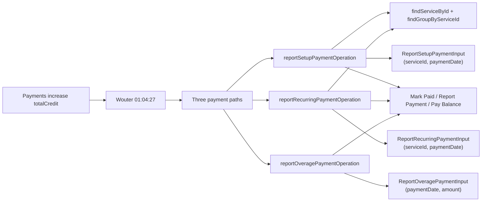

# Payment Reporting — Traceability

## Flow Diagram



---

## 1. Rule

**Payments increase `totalCredit`. Three paths: setup (one-time, amount read from state), recurring (per-cycle, amount read from state), and overage (arbitrary amount up to outstanding balance). Setup and recurring payments are constrained — the reducer reads the amount from the entity's cost on state, so the caller cannot override it.**

No status guard — payments are always accepted regardless of subscription status (D-6). This makes sense: a cancelled subscriber can still pay an outstanding balance.

---

## 2. Stakeholder Source

**Wouter @ 01:04:27 (Platform Sprint Planning 2026-04-09)**:

> "If the payment comes in you update the credit."

---

## 3. Previous Design

The original payment operations accepted `amount: Amount_Money!` and `currency: Currency!` on both `ReportSetupPaymentInput` and `ReportRecurringPaymentInput`. The caller provided the payment amount, and the reducer added it to `totalCredit` directly. There were no guards against double-payment or missing cost entries.

**What changed**:

| Aspect | Before | After |
|--------|--------|-------|
| Setup input | `serviceId`, `paymentDate`, `amount`, `currency` | `serviceId`, `paymentDate` only |
| Recurring input | `serviceId`, `paymentDate`, `amount`, `currency` | `serviceId`, `paymentDate` only |
| Amount source | Caller-provided | Reducer reads from `setupCost.amount` / `recurringCost.amount` on state |
| Setup guard | None | `ReportSetupPaymentAlreadyPaidError` if `paymentDate` already set |
| Setup guard | None | `ReportSetupPaymentNoCostError` if no `setupCost` on entity |
| Recurring guard | None | `ReportRecurringPaymentAlreadyPaidThisCycleError` if `lastPaymentDate >= currentBillingCycleStart` |
| Recurring guard | None | `ReportRecurringPaymentNoCostError` if no `recurringCost` on entity |
| Overage path | Did not exist | New `REPORT_OVERAGE_PAYMENT` operation for partial/full balance payments |

---

## 4. Reducer Implementation

### `reportSetupPaymentOperation`

**File**: [service.ts:155-191](document-models/subscription-instance/v1/src/reducers/service.ts#L155-L191)

```typescript
reportSetupPaymentOperation(state, action) {
  // Find entity by serviceId — can be a service or a group
  const svc = findServiceById(
    action.input.serviceId,
    state.services,
    state.serviceGroups,
  );
  const directGroup = state.serviceGroups.find(
    (g) => g.id === action.input.serviceId,
  );
  if (!svc && !directGroup) {
    throw new ReportSetupPaymentServiceNotFoundError(
      `Service or group with ID ${action.input.serviceId} not found`,
    );
  }
  // Resolve the entity that carries setupCost
  const group =
    directGroup ??
    findGroupByServiceId(action.input.serviceId, state.serviceGroups);
  const setupEntity =
    (svc?.setupCost ? svc : null) ?? (group?.setupCost ? group : null);
  if (!setupEntity || !setupEntity.setupCost) {
    throw new ReportSetupPaymentNoCostError(
      `No setup cost found for ID ${action.input.serviceId}`,
    );
  }
  // Guard: already paid
  if (setupEntity.setupCost.paymentDate) {
    throw new ReportSetupPaymentAlreadyPaidError(
      `Setup cost for ID ${action.input.serviceId} is already paid`,
    );
  }
  // Mark paid and credit the exact cost amount from state
  setupEntity.setupCost.paymentDate = action.input.paymentDate;
  state.totalCredit =
    (state.totalCredit ?? 0) + setupEntity.setupCost.amount;
},
```

### `reportRecurringPaymentOperation`

**File**: [service.ts:192-234](document-models/subscription-instance/v1/src/reducers/service.ts#L192-L234)

```typescript
reportRecurringPaymentOperation(state, action) {
  // Find entity by serviceId — can be a service or a group
  const svc = findServiceById(
    action.input.serviceId,
    state.services,
    state.serviceGroups,
  );
  const directGroup = state.serviceGroups.find(
    (g) => g.id === action.input.serviceId,
  );
  if (!svc && !directGroup) {
    throw new ReportRecurringPaymentServiceNotFoundError(
      `Service or group with ID ${action.input.serviceId} not found`,
    );
  }
  // Resolve the entity that carries recurringCost
  const group =
    directGroup ??
    findGroupByServiceId(action.input.serviceId, state.serviceGroups);
  const recurringEntity =
    (svc?.recurringCost ? svc : null) ??
    (group?.recurringCost ? group : null);
  if (!recurringEntity || !recurringEntity.recurringCost) {
    throw new ReportRecurringPaymentNoCostError(
      `No recurring cost found for ID ${action.input.serviceId}`,
    );
  }
  // Guard: one payment per billing cycle
  if (
    recurringEntity.recurringCost.lastPaymentDate &&
    state.currentBillingCycleStart &&
    recurringEntity.recurringCost.lastPaymentDate >=
      state.currentBillingCycleStart
  ) {
    throw new ReportRecurringPaymentAlreadyPaidThisCycleError(
      `Recurring cost for ID ${action.input.serviceId} already paid this cycle`,
    );
  }
  // Mark paid and credit the exact cost amount from state
  recurringEntity.recurringCost.lastPaymentDate = action.input.paymentDate;
  state.totalCredit =
    (state.totalCredit ?? 0) + recurringEntity.recurringCost.amount;
},
```

### `reportOveragePaymentOperation`

**File**: [service.ts:275-288](document-models/subscription-instance/v1/src/reducers/service.ts#L275-L288)

```typescript
reportOveragePaymentOperation(state, action) {
  if (action.input.amount <= 0) {
    throw new ReportOveragePaymentInvalidAmountError(
      "Payment amount must be greater than zero",
    );
  }
  const currentOwed = (state.totalDebt ?? 0) - (state.totalCredit ?? 0);
  if (action.input.amount > currentOwed) {
    throw new ReportOveragePaymentExceedsDebtError(
      `Payment amount ${action.input.amount} exceeds outstanding balance ${currentOwed}`,
    );
  }
  state.totalCredit = (state.totalCredit ?? 0) + action.input.amount;
},
```

**Key behaviors**:
- **Setup**: Reads `setupCost.amount` from state. Guards against double-pay (`paymentDate` already set) and missing cost (`no setupCost` on entity). No caller-supplied amount.
- **Recurring**: Reads `recurringCost.amount` from state. Guards against paying twice in the same billing cycle (`lastPaymentDate >= currentBillingCycleStart`) and missing cost. No caller-supplied amount.
- **Overage**: Caller supplies `amount`, constrained to `<= amountOwed` (`totalDebt - totalCredit`). No entity-level marking — the counter model handles overage tracking.
- All three: no status guard — payments accepted in any status (D-6).
- Group ID can be passed directly via `serviceId` field — so empty groups (no services) can still receive payments (setup and recurring paths).

---

## 5. Calculation Utils

| Function | File | Purpose |
|----------|------|---------|
| `findServiceById(serviceId, services, serviceGroups)` | [utils.ts:157-169](document-models/subscription-instance/v1/src/utils.ts#L157-L169) | Search flat + grouped services |
| `findGroupByServiceId(serviceId, serviceGroups)` | [utils.ts:175-185](document-models/subscription-instance/v1/src/utils.ts#L175-L185) | Find parent group of a service |

---

## 6. Schema

```graphql
input ReportSetupPaymentInput {
    serviceId: OID!          # Can be service ID or group ID
    paymentDate: DateTime!
}

input ReportRecurringPaymentInput {
    serviceId: OID!          # Can be service ID or group ID
    paymentDate: DateTime!
}

input ReportOveragePaymentInput {
    paymentDate: DateTime!
    amount: Amount_Money!    # Constrained to <= amountOwed by reducer
}
```

### Error Types

| Operation | Error | Condition |
|-----------|-------|-----------|
| `REPORT_SETUP_PAYMENT` | `ReportSetupPaymentServiceNotFoundError` | No service or group matches `serviceId` |
| `REPORT_SETUP_PAYMENT` | `ReportSetupPaymentNoCostError` | Matched entity has no `setupCost` |
| `REPORT_SETUP_PAYMENT` | `ReportSetupPaymentAlreadyPaidError` | `setupCost.paymentDate` is already set |
| `REPORT_RECURRING_PAYMENT` | `ReportRecurringPaymentServiceNotFoundError` | No service or group matches `serviceId` |
| `REPORT_RECURRING_PAYMENT` | `ReportRecurringPaymentNoCostError` | Matched entity has no `recurringCost` |
| `REPORT_RECURRING_PAYMENT` | `ReportRecurringPaymentAlreadyPaidThisCycleError` | `lastPaymentDate >= currentBillingCycleStart` |
| `REPORT_OVERAGE_PAYMENT` | `ReportOveragePaymentInvalidAmountError` | `amount <= 0` |
| `REPORT_OVERAGE_PAYMENT` | `ReportOveragePaymentExceedsDebtError` | `amount > (totalDebt - totalCredit)` |

---

## 7. Editor UI

### BillingPanel

**File**: [BillingPanel.tsx](editors/subscription-instance-editor/components/BillingPanel.tsx)

- **"Mark Paid"** button on unpaid setup costs — visible when `setupCost.paymentDate` is null. No longer sends `amount` or `currency`; the reducer reads the amount from state.
- **"Report Payment"** button on recurring costs — with once-per-cycle guard (disabled if `lastPaymentDate` is within current cycle). No longer sends `amount` or `currency`; the reducer reads the amount from state.
- **"Pay Balance"** button for overage/remaining balance — dispatches `REPORT_OVERAGE_PAYMENT` with user-entered `amount` constrained to outstanding balance.
- Uses group ID directly so empty groups (no services inside) still have a payment target.
- After payment: Outstanding Balance decreases; setup shows "Paid" tag.

---

## 8. Test Procedure

### Setup payment

1. Activate with a service/group that has `setupCost` defined.
2. Click **Mark Paid** on that setup cost.
3. Verify:
   - `totalCredit` increases by `setupCost.amount` (the amount on state, not caller-supplied).
   - Setup cost shows "Paid" tag.
   - Outstanding Balance decreases.
4. Click **Mark Paid** again on the same entity.
5. Verify: operation recorded with `ReportSetupPaymentAlreadyPaidError`, state unchanged.

### Setup payment — no cost

1. Find a service/group that has no `setupCost`.
2. Dispatch `REPORT_SETUP_PAYMENT` for that entity.
3. Verify: operation recorded with `ReportSetupPaymentNoCostError`, state unchanged.

### Recurring payment

1. Activate with a service/group that has `recurringCost` defined.
2. Click **Report Payment** on that recurring cost.
3. Verify:
   - `totalCredit` increases by `recurringCost.amount`.
   - `lastPaymentDate` updated to the payment date.
   - Outstanding Balance decreases.
4. Click **Report Payment** again in the same billing cycle.
5. Verify: operation recorded with `ReportRecurringPaymentAlreadyPaidThisCycleError`, state unchanged.

### Recurring payment — no cost

1. Find a service/group that has no `recurringCost`.
2. Dispatch `REPORT_RECURRING_PAYMENT` for that entity.
3. Verify: operation recorded with `ReportRecurringPaymentNoCostError`, state unchanged.

### Overage payment

1. Create a state with `totalDebt > totalCredit` (outstanding balance exists).
2. Click **Pay Balance**, enter an amount within the outstanding balance.
3. Verify:
   - `totalCredit` increases by the entered amount.
   - Outstanding Balance decreases accordingly.
4. Attempt to pay more than the outstanding balance.
5. Verify: operation recorded with `ReportOveragePaymentExceedsDebtError`, state unchanged.
6. Attempt to pay a zero or negative amount.
7. Verify: operation recorded with `ReportOveragePaymentInvalidAmountError`, state unchanged.

### Payment on group directly

1. Find a service group with no services inside but with `recurringCost`.
2. Report payment using the group ID.
3. Verify: payment accepted, `totalCredit` updated with `recurringCost.amount`.

### Payment in any status (D-6)

1. Cancel a subscription (or set to any non-active status).
2. Report a payment (any of the three paths).
3. Verify: payment accepted — no status guard blocks it.
