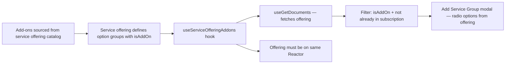

# Cross-Document Read (Service Offering → Subscription) — Traceability

## Flow Diagram

---

## 1. Rule

**When adding a service group mid-cycle, the available add-ons come from the service offering catalog, not free-form entry.**

The subscription stores `serviceOfferingId` as a PHID reference to the source offering. The editor reads the offering to present available add-on groups with their pricing.

---

## 2. Source

Service offering defines option groups with `isAddOn: true` and standalone pricing. These are the groups available for mid-cycle addition to subscriptions created from that offering.

---

## 3. Hook Implementation

### `useServiceOfferingAddons`

**File**: [useServiceOfferingAddons.ts](editors/subscription-instance-editor/hooks/useServiceOfferingAddons.ts)

- Accepts `serviceOfferingId` (PHID) and `existingGroupNames` (already in subscription)
- Fetches the offering document via `useGetDocuments`
- Filters option groups: `isAddOn === true` AND name not in `existingGroupNames`
- Returns available add-on groups with their pricing for the modal

---

## 4. Editor UI

### Add Service Group modal

**File**: [ServicesPanel.tsx](editors/subscription-instance-editor/components/ServicesPanel.tsx)

- Modal shows radio options from the offering (not free-form input)
- Each option displays the group name and pricing
- Selecting an option populates the `addServiceGroup` action with the offering's pricing

---

## 5. Constraint

The offering must be accessible from the same Reactor. Remote offerings need to be synced as a remote drive first. This is a Reactor/Switchboard limitation, not a document model limitation.
