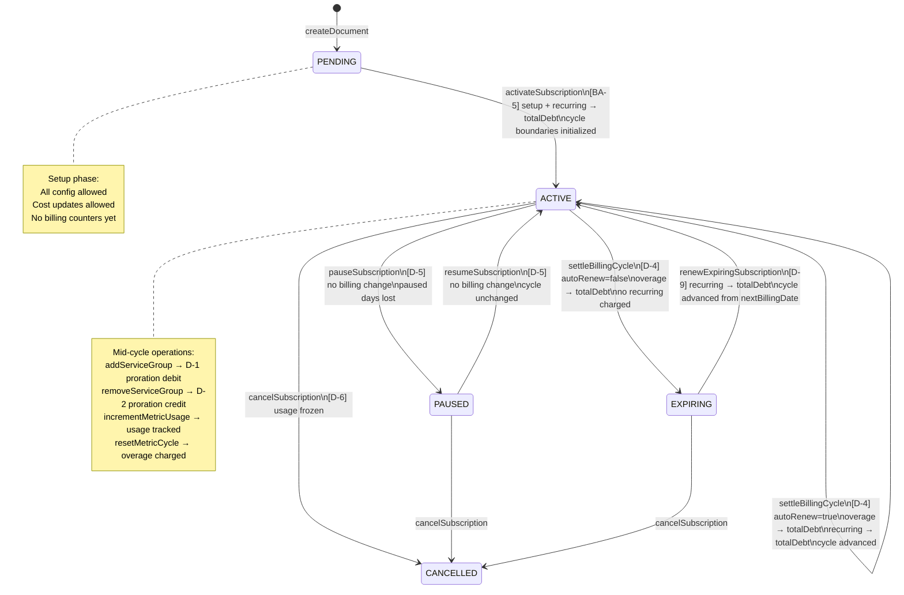
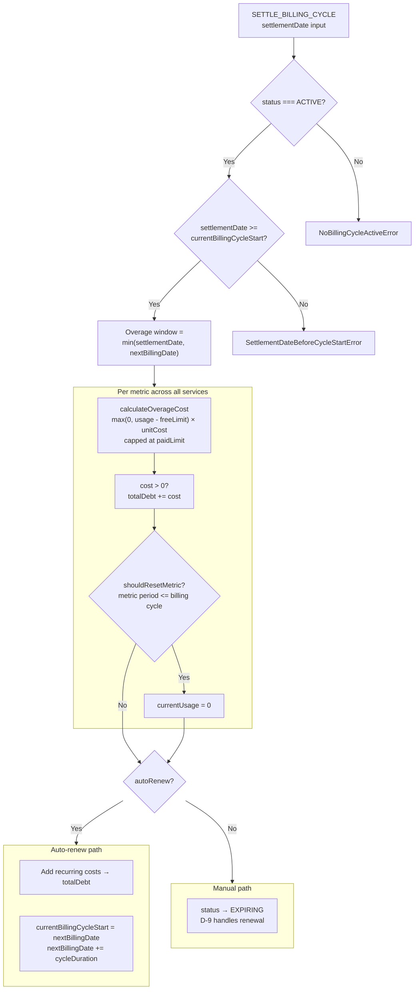
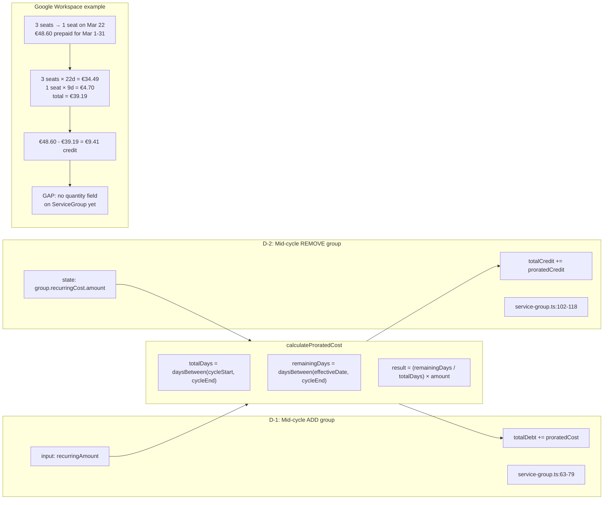
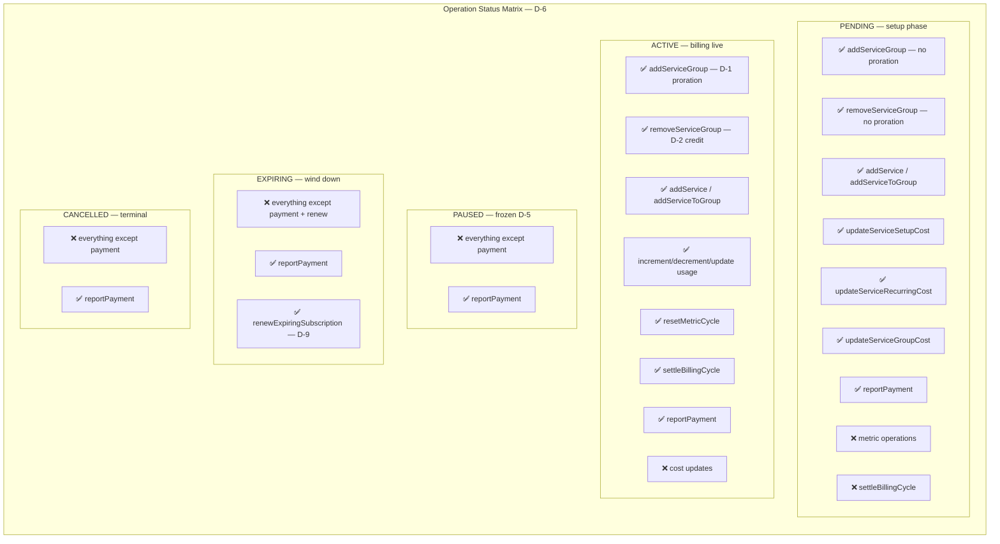
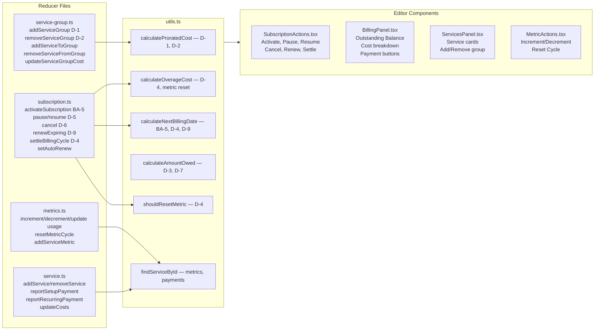

# Billing Lifecycle — Unified Diagram

Copy each diagram into Excalidraw's mermaid import (or render with any mermaid viewer).

---

## 1. Subscription State Machine

---

## 2. Money Flow (Debt / Credit / Balance)

```mermaid
flowchart TB
    subgraph DEBT["totalDebt (charges)"]
        direction TB
        BA5["BA-5: Activation\nsetup + recurring costs"]
        D1["D-1: Mid-cycle group add\ncalculateProratedCost → debit"]
        D4_OVR["D-4: Settlement overage\ncalculateOverageCost per metric"]
        D4_REC["D-4: Settlement recurring\nnext cycle costs if autoRenew"]
        D9_REC["D-9: Manual renewal\nrecurring costs for new cycle"]
        MET_RST["Metric reset\noverage charged before reset"]
    end

    subgraph CREDIT["totalCredit (payments + credits)"]
        direction TB
        D2["D-2: Mid-cycle group remove\ncalculateProratedCost → credit"]
        PAY_S["reportSetupPayment\namount → credit"]
        PAY_R["reportRecurringPayment\namount → credit"]
    end

    subgraph BALANCE["Outstanding Balance = totalDebt − totalCredit"]
        direction TB
        POS["Positive → owes money 🔴"]
        ZERO["Zero → paid up ⚪"]
        NEG["Negative → credit surplus 🟢\nD-7: carries forward, no floor"]
    end

    DEBT --> BALANCE
    CREDIT --> BALANCE

    subgraph D3["D-3: Counters, not arrays"]
        direction TB
        AUDIT["Audit trail = Reactor operation history"]
        NO_LEDGER["No ledger entries on state"]
    end

    subgraph D8["D-8: No debt guard on settlement"]
        direction TB
        NO_BLOCK["Settlement always succeeds\ndebt is a UI concern"]
    end
```

---

## 3. Settlement Flow (D-4 Detail)

---

## 4. Proration Formula (D-1 / D-2)

---

## 5. Operation Status Matrix (D-6)

---

## 6. File Map

