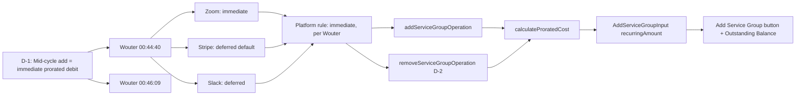

# D-1: Proration Charge Timing — Traceability

## Flow Diagram



---

## 1. Rule

**Mid-cycle service group add = immediate prorated debit to totalDebt. Not configurable per operator.**

Pricing lives on **service groups**, not individual services. When an operator adds a service group (add-on) mid-cycle, the group's `recurringAmount` is prorated for the remaining days in the cycle and added to `totalDebt` immediately.

Services within groups don't carry pricing — they're deliverables. The group is the billable unit.

---

## 2. Stakeholder Source

**Wouter @ 00:44:40 (Platform Sprint Planning 2026-04-09)**:

> "What typically happens is like if you for example you have like Dropbox subscription or something right and you add a user you add a seat, so what's going to happen is it's going to charge you immediately going to charge you prorata for the ongoing billing cycle like that's how complicated it is"

**Wouter @ 00:46:09**:

> "If it's a month of 30 days and we're 10 days in, I'm going to pay 2/3 right for the 20 days that are still remaining."

This gives us:
- The rule: charge immediately on add
- The formula: `remainingDays / totalDays * cost`
- The example: 30-day cycle, 10 days in, 20 remaining = 2/3 of cost

---

## 3. Real-World Validation

### Zoom (verified)

**URL**: https://support.zoom.com/hc/en/article?id=zm_kb&sysparm_article=KB0063375

**Key quote**: "If you upgrade in the middle of a billing period, your account will be credited a prorated amount for the time remaining on your existing subscription, and you will be charged for the upgrade with the credit applied."

**Verdict**: Immediate prorated charge. Matches our rule.

---

### Stripe (verified)

**URL**: https://docs.stripe.com/billing/subscriptions/prorations

**Key quote**: "The default parameter for `proration_behavior` is `create_prorations`, which creates proration invoice items when applicable" — these are invoiced at next cycle, not immediately.

**Verdict**: Default is deferred. Configurable to immediate via `always_invoice`. We chose immediate per Wouter's directive.

---

### Slack (verified)

**URL**: https://slack.com/help/articles/218915077-Slacks-Fair-Billing-Policy

**Key quote**: "We'll divide the cost per member by the number of days in the month, then multiply by the remaining number of days in the month." and "We'll calculate the prorated cost and bill you the following month for any new members added."

**Verdict**: Same formula (`cost/days * remaining`), but deferred to next month. We chose immediate timing per Wouter.

---

## 4. Reducer Implementation

### `addServiceGroupOperation`

**File**: [service-group.ts:17-80](document-models/subscription-instance/v1/src/reducers/service-group.ts#L17-L80)

```typescript
addServiceGroupOperation(state, action) {
  // D-6 revised: PENDING or ACTIVE — groups carry pricing, proration applies
  if (state.status !== "PENDING" && state.status !== "ACTIVE") {
    throw new StructuralChangeNotAllowedAddGroupError(
      `Cannot add service group when status is ${state.status}`,
    );
  }
  
  // ... create group with recurringCost, setupCost ...
  state.serviceGroups.push({ ... });

  // D-1: Mid-cycle proration on the GROUP's recurring cost
  if (
    state.status === "ACTIVE" &&
    action.input.recurringAmount &&
    state.currentBillingCycleStart &&
    state.nextBillingDate
  ) {
    const proratedCost = calculateProratedCost(
      action.input.recurringAmount,
      state.currentBillingCycleStart,
      state.nextBillingDate,
      new Date().toISOString(),
    );
    if (proratedCost > 0) {
      state.totalDebt = (state.totalDebt ?? 0) + proratedCost;
    }
  }
  // Setup cost added to debt immediately if ACTIVE
  if (state.status === "ACTIVE" && action.input.setupAmount) {
    state.totalDebt = (state.totalDebt ?? 0) + action.input.setupAmount;
  }
},
```

**Key behaviors**:
- Status guard: PENDING or ACTIVE (revised from PENDING-only)
- Proration only when ACTIVE + group has recurringAmount
- Setup cost added in full immediately (one-time, not prorated)
- PENDING = setup phase, no proration (no active cycle)
- Prorated cost added to `totalDebt` immediately

### Why services don't have proration

Individual services (`addService`, `addServiceToGroup`) don't carry pricing — they're deliverables within a group. The group's `recurringCost` covers all its services. Adding/removing a service within a group doesn't change the billing amount.

---

## 5. Calculation Utils

**File**: [utils.ts:58-68](document-models/subscription-instance/v1/src/utils.ts#L58-L68)

```typescript
export function calculateProratedCost(
  amount: number,
  cycleStart: string,
  cycleEnd: string,
  effectiveDate: string,
): number {
  const totalDays = daysBetween(cycleStart, cycleEnd);
  const remainingDays = daysBetween(effectiveDate, cycleEnd);
  if (totalDays <= 0 || remainingDays <= 0) return 0;
  return (remainingDays / totalDays) * amount;
}
```

**Helper** ([utils.ts:30-33](document-models/subscription-instance/v1/src/utils.ts#L30-L33)):

```typescript
function daysBetween(a: string, b: string): number {
  return (
    (new Date(b).getTime() - new Date(a).getTime()) / (1000 * 60 * 60 * 24)
  );
}
```

**Wouter's example verification**:
- Input: `amount=100, cycleStart=Apr 1, cycleEnd=May 1, effectiveDate=Apr 11`
- `totalDays = 30`
- `remainingDays = 20`
- Result: `(20/30) * 100 = 66.67` — customer pays 2/3. Matches "I'm going to pay 2/3 for the 20 days still remaining."

---

## 6. Schema (Input Types)

**File**: [schema.graphql:422-434](document-models/subscription-instance/v1/schema.graphql#L422-L434)

```graphql
input AddServiceGroupInput {
    groupId: OID!
    name: String!
    optional: Boolean!
    costType: GroupCostType
    setupAmount: Amount_Money          # one-time cost, added to debt immediately
    setupCurrency: Currency
    setupBillingDate: DateTime
    recurringAmount: Amount_Money      # <-- D-1: prorated for remaining cycle
    recurringCurrency: Currency
    recurringBillingCycle: BillingCycle
    recurringDiscount: DiscountServiceInfoInput
}
```

The `recurringAmount` is the billable amount that gets prorated. No `effectiveDate` needed on the input — the reducer uses `new Date().toISOString()` as the effective date since the charge is immediate.

---

## 7. Editor UI

### "+ Add Service Group" button

**File**: [ServicesPanel.tsx:221-320](editors/subscription-instance-editor/components/ServicesPanel.tsx#L221-L320)

- Button at the bottom of the Recurring Services panel, visible in **operator mode** when status is PENDING or ACTIVE
- Opens modal with:
  - Group Name (required)
  - Recurring Amount in `globalCurrency` per `selectedBillingCycle` (e.g., "USD quarterly")
- Dispatches `addServiceGroup({ groupId, name, optional: true, recurringAmount, ... })`
- When ACTIVE: reducer prorates `recurringAmount` for remaining cycle → `totalDebt` increases
- When PENDING: no proration, just configuration

### Outstanding Balance display

**File**: [BillingPanel.tsx:86-148](editors/subscription-instance-editor/components/BillingPanel.tsx#L86-L148)

- Shows `totalDebt - totalCredit` as "Outstanding Balance"
- Updates immediately when proration adds to `totalDebt`
- Red alert styling when balance > 0

---

## 8. Test Procedure

**Subscription**: `http://localhost:3001/d/preview-1e38b0a0/cb6e4e79-3198-4a01-8de1-595e492341e0`

### Step 1: Activate

1. Switch to **Operator View**
2. Click **Activate**
3. Verify:
   - Status: ACTIVE
   - Cycle: Apr 16 → Jul 16 (91 days quarterly)
   - Outstanding Balance: **$3,250** ($2,500 setup + $750 recurring)

### Step 2: Pay initial charges

1. Click **Mark Paid** on Entity & Compliance setup ($2,500)
2. Click **Report Payment** on Financial Ops recurring ($750)
3. Verify:
   - Outstanding Balance: **$0.00** (or "Paid up")

### Step 3: Add a service group mid-cycle (D-1 test)

1. Click **"+ Add Service Group"** at the bottom of Recurring Services
2. Enter:
   - Group Name: "Premium Support Add-on"
   - Recurring Amount: **200** (USD quarterly)
3. Click **Add Group**
4. Verify:
   - New group "Premium Support Add-on" appears in the services panel
   - Outstanding Balance increases by the **prorated amount**
   - Expected proration: if today is ~April 16 and cycle ends July 16, remaining ≈ 91 days out of 91 total → proration ≈ $200 (nearly full cycle since you just activated)
   - The exact amount depends on when you click — later in the cycle = less proration

### Step 4: Verify the math

Check the operation history in Connect (click the `{}` icon). The `ADD_SERVICE_GROUP` operation should show, and the document state should show:
- `totalDebt`: $3,250 + prorated amount (e.g., $3,450 if ~$200 proration)
- `totalCredit`: $3,250
- Outstanding Balance: the prorated amount

### Step 5: Test D-2 (removal credit)

1. The new "Premium Support Add-on" group should be removable (it has `optional: true`)
2. Remove it — the reducer will calculate prorated credit and add to `totalCredit`
3. Outstanding Balance should decrease by the prorated credit amount

Note: the Remove button is on individual services within groups, not on groups themselves yet. To remove the group, you'd need to dispatch `REMOVE_SERVICE_GROUP` via MCP. This is an editor gap — the "remove group" UI is not yet built.
