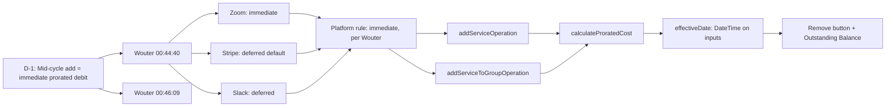

# D-1: Proration Charge Timing — Traceability

## Flow Diagram



---

## 1. Rule

**Mid-cycle service add = immediate prorated debit to totalDebt. Not configurable per operator.**

This is a platform-level billing mechanic baked into the reducers. Operators don't choose — Wouter defined it explicitly.

---

## 2. Stakeholder Source

**Wouter @ 00:44:40 (Platform Sprint Planning 2026-04-09)**:

> "What typically happens is like if you for example you have like Dropbox subscription or something right and you add a user you add a seat, so what's going to happen is it's going to charge you immediately going to charge you prorata for the ongoing billing cycle like that's how complicated it is"

**Wouter @ 00:46:09**:

> "If it's a month of 30 days and we're 10 days in, I'm going to pay 2/3 right for the 20 days that are still remaining."

This gives us:
- The rule: charge immediately on add
- The formula: `remainingDays / totalDays * cost`
- The example: 30-day cycle, 10 days in, 20 remaining = 2/3 of cost

---

## 3. Real-World Validation

### Zoom (verified)

**URL**: https://support.zoom.com/hc/en/article?id=zm_kb&sysparm_article=KB0063375

**Key quote**: "If you upgrade in the middle of a billing period, your account will be credited a prorated amount for the time remaining on your existing subscription, and you will be charged for the upgrade with the credit applied."

**Screenshot**: [Take screenshot of the Zoom support page at the URL above]

**Verdict**: Immediate prorated charge. Matches our rule.

---

### Stripe (verified)

**URL**: https://docs.stripe.com/billing/subscriptions/prorations

**Key quote**: "The default parameter for `proration_behavior` is `create_prorations`, which creates proration invoice items when applicable" — these are invoiced at next cycle, not immediately.

**Screenshot**: [Take screenshot of the Stripe docs page at the URL above]

**Verdict**: Default is deferred. Configurable to immediate via `always_invoice`. We chose immediate per Wouter's directive.

---

### Slack (verified)

**URL**: https://slack.com/help/articles/218915077-Slacks-Fair-Billing-Policy

**Key quote**: "We'll divide the cost per member by the number of days in the month, then multiply by the remaining number of days in the month." and "We'll calculate the prorated cost and bill you the following month for any new members added."

**Screenshot**: [Take screenshot of the Slack help page at the URL above]

**Verdict**: Same formula (`cost/days * remaining`), but deferred to next month. We chose immediate timing per Wouter.

---

## 4. Reducer Implementation

### 4a. `addServiceOperation`

**File**: [service.ts:22-88](document-models/subscription-instance/v1/src/reducers/service.ts#L22-L88)

```typescript
addServiceOperation(state, action) {
  // D-6: Status guard — PENDING or ACTIVE only
  if (state.status !== "PENDING" && state.status !== "ACTIVE") {
    throw new SubscriptionNotActiveAddServiceError(
      `Cannot add service when status is ${state.status}`,
    );
  }
  
  // ... service creation ...
  
  state.services.push(service);

  // D-1: Mid-cycle proration — add prorated cost to totalDebt
  if (
    state.status === "ACTIVE" &&
    action.input.effectiveDate &&
    action.input.recurringAmount &&
    state.currentBillingCycleStart &&
    state.nextBillingDate
  ) {
    const proratedCost = calculateProratedCost(
      action.input.recurringAmount,
      state.currentBillingCycleStart,
      state.nextBillingDate,
      action.input.effectiveDate,
    );
    if (proratedCost > 0) {
      state.totalDebt = (state.totalDebt ?? 0) + proratedCost;
    }
  }
},
```

**Key behaviors**:
- Status guard: only PENDING or ACTIVE
- Proration only when ACTIVE + effectiveDate provided
- PENDING = setup phase, no proration (no active cycle)
- Prorated cost added to `totalDebt` immediately

### 4b. `addServiceToGroupOperation`

**File**: [service-group.ts:80-144](document-models/subscription-instance/v1/src/reducers/service-group.ts#L80-L144)

```typescript
addServiceToGroupOperation(state, action) {
  // D-6: Status guard — PENDING or ACTIVE only
  if (state.status !== "PENDING" && state.status !== "ACTIVE") {
    throw new SubscriptionNotActiveAddToGroupError(
      `Cannot add service to group when status is ${state.status}`,
    );
  }
  
  // ... find group, push service ...

  // D-1: Mid-cycle proration — add prorated cost to totalDebt
  if (
    state.status === "ACTIVE" &&
    action.input.effectiveDate &&
    action.input.recurringAmount &&
    state.currentBillingCycleStart &&
    state.nextBillingDate
  ) {
    const proratedCost = calculateProratedCost(
      action.input.recurringAmount,
      state.currentBillingCycleStart,
      state.nextBillingDate,
      action.input.effectiveDate,
    );
    if (proratedCost > 0) {
      state.totalDebt = (state.totalDebt ?? 0) + proratedCost;
    }
  }
},
```

Same pattern — identical proration logic for grouped services.

---

## 5. Calculation Utils

**File**: [utils.ts:58-68](document-models/subscription-instance/v1/src/utils.ts#L58-L68)

```typescript
/**
 * Core proration formula: (remainingDays / totalCycleDays) x amount
 *
 * D-1: mid-cycle add = prorated debit
 * D-2: mid-cycle remove = prorated credit (same formula, reversed direction)
 */
export function calculateProratedCost(
  amount: number,
  cycleStart: string,
  cycleEnd: string,
  effectiveDate: string,
): number {
  const totalDays = daysBetween(cycleStart, cycleEnd);
  const remainingDays = daysBetween(effectiveDate, cycleEnd);
  if (totalDays <= 0 || remainingDays <= 0) return 0;
  return (remainingDays / totalDays) * amount;
}
```

**Helper** ([utils.ts:30-33](document-models/subscription-instance/v1/src/utils.ts#L30-L33)):

```typescript
function daysBetween(a: string, b: string): number {
  return (
    (new Date(b).getTime() - new Date(a).getTime()) / (1000 * 60 * 60 * 24)
  );
}
```

**Wouter's example verification**:
- Input: `amount=100, cycleStart=Apr 1, cycleEnd=May 1, effectiveDate=Apr 11`
- `totalDays = 30`
- `remainingDays = 20`
- Result: `(20/30) * 100 = 66.67` — customer pays 2/3. Matches "I'm going to pay 2/3 for the 20 days still remaining."

---

## 6. Schema (Input Types)

**File**: [schema.graphql:347-368](document-models/subscription-instance/v1/schema.graphql#L347-L368)

```graphql
input AddServiceInput {
    serviceId: OID!
    name: String
    description: String
    customValue: String
    setupAmount: Amount_Money
    setupCurrency: Currency
    setupBillingDate: DateTime
    setupPaymentDate: DateTime
    recurringAmount: Amount_Money
    recurringCurrency: Currency
    recurringBillingCycle: BillingCycle
    recurringNextBillingDate: DateTime
    recurringLastPaymentDate: DateTime
    recurringDiscount: DiscountServiceInfoInput
    effectiveDate: DateTime                     # <-- D-1: proration anchor
}

input RemoveServiceInput {
    serviceId: OID!
    effectiveDate: DateTime                     # <-- D-2: same field, credit direction
}
```

`effectiveDate` is optional — when null (PENDING status), no proration. When provided (ACTIVE status), triggers the proration calculation.

---

## 7. Editor UI

### Remove Service button (with proration)

**File**: [ServicesPanel.tsx:192-210](editors/subscription-instance-editor/components/ServicesPanel.tsx#L192-L210)

- Button visible in **operator mode** when status is ACTIVE or PENDING
- When ACTIVE: dispatches `removeServiceFromGroup` with `effectiveDate: new Date().toISOString()` — triggers proration credit (D-2, same formula reversed)
- When PENDING: dispatches without `effectiveDate` — no proration

**Screenshot**: [Take screenshot of the service card with the "Remove" button visible in operator mode]

### Outstanding Balance display

**File**: [BillingPanel.tsx:86-148](editors/subscription-instance-editor/components/BillingPanel.tsx#L86-L148)

- Shows `totalDebt - totalCredit` as "Outstanding Balance"
- Updates immediately when proration adds to `totalDebt`
- Shows overage breakdown when applicable

**Screenshot**: [Take screenshot showing the Outstanding Balance section in the billing panel]

---

## 8. Gap

**Add Service UI is missing**. The reducer and schema support `ADD_SERVICE` and `ADD_SERVICE_TO_GROUP` with `effectiveDate`, but the editor has no button to add a service to a group mid-cycle. Only removal is wired. Adding a service requires dispatching the operation via MCP or Switchboard, not via the editor UI.

This is a known gap from the traceability audit.
