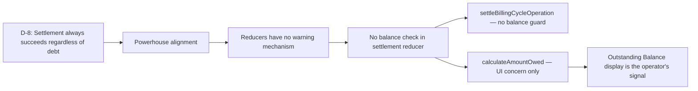

# D-8: Outstanding Debt at Settlement (No Guard) — Traceability

## Flow Diagram

---

## 1. Rule

**Settlement always succeeds regardless of outstanding debt from previous cycles. No error, no warning, no gate.**

Debt is a derived UI concern, not a reducer gate. Blocking settlement while debt exists is counterproductive — overage accrues uncaptured, making things worse.

---

## 2. Stakeholder Source

No direct Wouter quote — this is a Powerhouse alignment decision.

**Rationale**:
- Powerhouse reducers have no warning mechanism — operations either succeed or throw (binary `.error` property)
- No existing Powerhouse reducer returns warnings or conditional feedback
- Blocking settlement while debt is outstanding would prevent overage from being captured, making the debt situation worse
- Whether to proceed with settlement despite debt is an operator judgment call, not a system rule

---

## 3. Real-World Validation

### Powerhouse pattern (verified)

The `.error` property on operations is binary — operations succeed or throw. There is no concept of "succeed with warning." No existing document model in the Powerhouse ecosystem uses a balance-check gate on settlement-type operations.

---

## 4. Reducer Implementation

### `settleBillingCycleOperation` — What's NOT there

**File**: [subscription.ts:355-427](document-models/subscription-instance/v1/src/reducers/subscription.ts#L355-L427)

The settlement reducer has two guards:
1. Status must be ACTIVE (`NoBillingCycleActiveError`)
2. Settlement date must be after cycle start (`SettlementDateBeforeCycleStartError`)

**Deliberately absent**: any check like `if (calculateAmountOwed(state) > 0) throw ...`. The reducer does not inspect outstanding debt.

---

## 5. Editor UI — Where the signal lives

### BillingPanel

**File**: [BillingPanel.tsx](editors/subscription-instance-editor/components/BillingPanel.tsx)

The Outstanding Balance display is the operator's signal:
- Red when positive (debt exists)
- The operator sees this before clicking "Settle Cycle"
- No programmatic blocker — the human makes the call

### SubscriptionActions

**File**: [SubscriptionActions.tsx](editors/subscription-instance-editor/components/SubscriptionActions.tsx)

The "Settle Cycle" button is always enabled when ACTIVE, regardless of balance. The operator can settle even with outstanding debt.

---

## 6. Test Procedure

1. Activate → add charges → do NOT pay (Outstanding Balance > 0)
2. Click "Settle Cycle"
3. Verify: settlement succeeds, overage added, cycle advanced
4. Verify: Outstanding Balance now includes both old debt + new cycle charges
